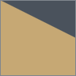
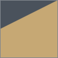
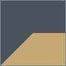
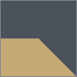
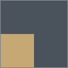
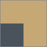
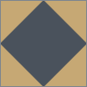

# NANAME Floors: Expanded

An add-on for [NANAME Floors](https://steamcommunity.com/sharedfiles/filedetails/?id=3293767181)
by LS, adding new terrain mask shapes.

Right now, this mod is **content only**. NANAME Floors discovers masks in *any* mod 
under `Textures/NanameFloors/TerrainMasks`.

## Shapes

| Mask | Coverage | Notes |
|---|---|---|
|  `QuarterTriangle_Left_Pos` | 25% | shallow triangle spanning the full tile |
|  `QuarterTriangle_Left_Neg` | 75% | negative of the above |
|  `QuarterTriangle_Right_Pos` | 25% | mirror of `_Left_Pos` |
|  `QuarterTriangle_Right_Neg` | 75% | negative of the above |
|  `QuarterSquare_EighthTriangle_Left_Pos` | 37.5% | quarter square + eighth triangle |
|  `QuarterSquare_EighthTriangle_Left_Neg` | 62.5% | negative of the above |
|  `QuarterSquare_EighthTriangle_Right_Pos` | 37.5% | mirror of `_Left_Pos` |
|  `QuarterSquare_EighthTriangle_Right_Neg` | 62.5% | negative of the above |
|  `QuarterSquare_Pos` | 25% | solid quadrant square |
|  `QuarterSquare_Neg` | 75% | negative of the above |
|  `QuarterCircle_Convex_Pos` | 19.6% | rounded outer corner of a quarter square |
|  `QuarterCircle_Convex_Neg` | 80.4% | negative of the above, a rounded edge |
|  `QuarterCircle_Concave_Pos` | 5.4% | quarter square - quarter circle |
|  `QuarterCircle_Concave_Neg` | 94.6% | negative of the above |
|  `HalfDiamond_Pos` | 50% | centred, points at the edge midpoints |
|  `HalfDiamond_Neg` | 50% | negative of the above, four corner triangles |

Names are built from the shape coverage: a quarter square plus an eighth triangle 
covers 37.5%. `_Pos` paints that shape, `_Neg` paints everything else.

All sixteen rotate in four directions in game (Q/E while placing) with mirrors where 
rotation can't produce them. Some masks do not rotate visible (like `HalfDiamond`), but
they will produce an additional floor def.

## Mask authoring notes

- 256×256 PNG
- Only the **alpha channel** is read by the shaders, but RGB is used for the picker directly.
- Opaque colour covers the terrain with your new floor, transparent keeps the underlying terrain.
- Gradient transparency can create "blended" terrains, rather than hard lines.
- Anti-aliasing helps non-linear edges look clean.
- Names should be unique across *all* installed mods. A collision will show the mask twice.
- Never **rename** a shipped mask. This will break floors in existing saves, if not the whole save.
- `Square` naming refers to actual square shapes, and `Rectangle` refers to full-width shapes.
- Labels and translations require a key matching the filename exactly to 
  `Languages/*/Keyed/TerrainMasks.xml` - a missing key will show the filename in the mod settings.

## Development

The repository is the mod folder. Symlink it into RimWorld's `Mods` directory.

On macOS that would look like:

```sh
ln -s ~/dev/arrisar/naname-floors \
  "$HOME/Library/Application Support/Steam/steamapps/common/RimWorld/RimWorldMac.app/Mods/NanameFloorsExpanded"
```

Thumbnails for this README are the masks recoloured for legibility. Rebuild them 
with `python tools/thumbnails.py` after adding or changing a mask.

Texture changes require a game restart - masks are cached in a startup step.

## Licence

MIT. NANAME Floors itself is MIT © LS and is not redistributed here.
